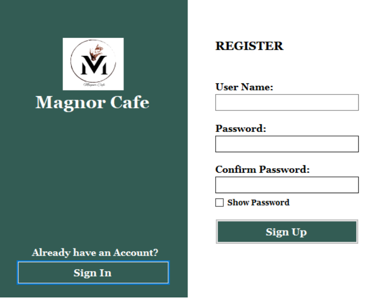
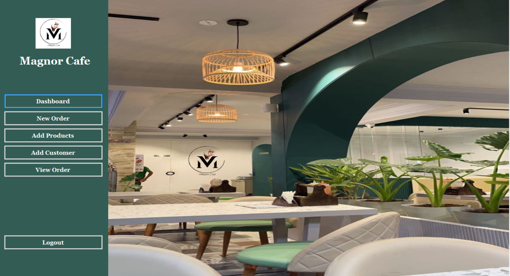
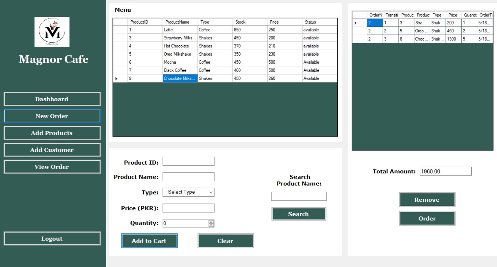
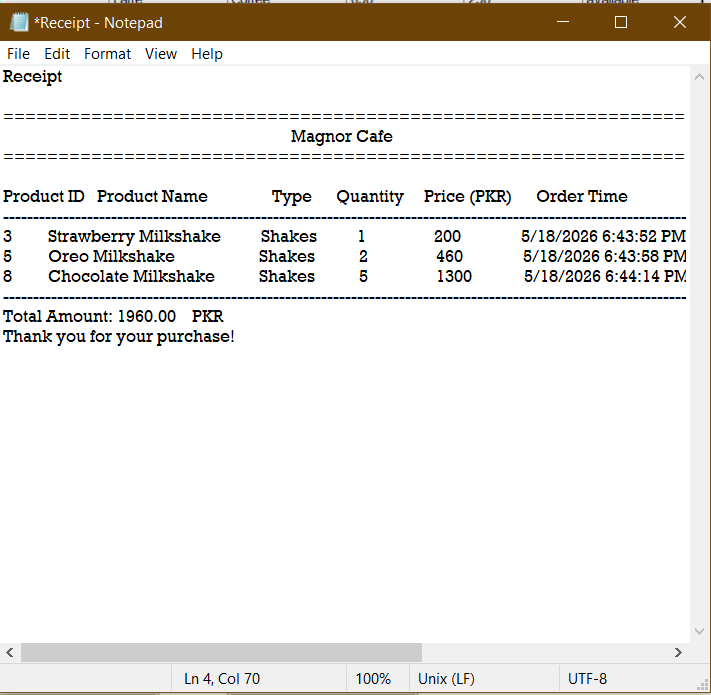

# ☕ Cafe Management System

  
  
  

---

## 📌 Project Overview

A comprehensive, desktop-based **Cafe Management System** designed to automate daily cafe operations, streamline order management, and maintain systematic customer records. This application provides an intuitive graphical user interface (GUI) built with **C#** and **.NET**, backed by a local **MySQL** database managed via **XAMPP**.

---

## 🎥 System Walkthrough & Demo

  <!-- Replace the src path below with your actual video or GIF file path -->
  

---

## ✨ Core Features

* **🔐 User Authentication:** Secure **Login** and **Registration** system.
* **🛍️ Order Processing:** Dynamic interface to take **Orders**, calculate totals instantly, and process sales smoothly.
* **🧾 Receipt Generation:** Automatic generation of clear, detailed billing **Receipts** for customers.
* **📦 Product Management:** Full CRUD operations via **Add Product** to easily update menu items, pricing, and stock.
* **👥 Customer Management:** Dedicated **Add Customer** and tracking module to maintain customer records.
* **👁️ Order Tracking:** A robust **View Order** history log to track previous transactions and sales data.

---

## 🛠️ Tech Stack & Prerequisites

| Component | Technology Used |
| :--- | :--- |
| **Frontend / UI** | Windows Forms (C#) |
| **Backend Logic** | .NET Framework |
| **Database** | MySQL (via XAMPP / phpMyAdmin) |
| **Development IDE** | Visual Studio |

---

## 📷 Screenshots Gallery

<table border="0">
  <tr>
    <td align="center" width="50%"><b>🔐 Sign in Screen</b></td>
    <td align="center" width="50%"><b>📝 Registration Screen</b></td>
  </tr>
  <tr>
    <td></td>
    <td></td>
  </tr>
  <tr>
    <td align="center"><b>📊 Main Dashboard</b></td>
    <td align="center"><b>🛍️ Order Management</b></td>
  </tr>
  <tr>
    <td></td>
    <td></td>
  </tr>
  <tr>
    <td align="center"><b>🧾 Receipt Generation</b></td>
    <td align="center"><b>➕ Add Product (Inventory)</b></td>
  </tr>
  <tr>
    <td></td>
    <td></td>
  </tr>
  <tr>
    <td align="center"><b>👥 Add Customer</b></td>
    <td align="center"><b>👁️ View Order History</b></td>
  </tr>
  <tr>
    <td></td>
    <td></td>
  </tr>
</table>

---
